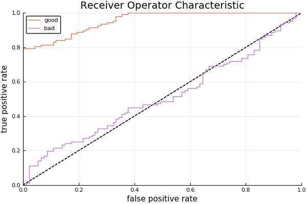

# ROC    

    

Linux, OSX: [](https://travis-ci.org/diegozea/ROC.jl)  
Windows: [](https://ci.appveyor.com/project/diegozea/roc-jl/branch/master)  
Code Coverage: [](https://coveralls.io/github/diegozea/ROC.jl?branch=master) [](http://codecov.io/github/diegozea/ROC.jl?branch=master)

An implementation of [ROC (Receiver Operating Characteristic) curves](http://en.wikipedia.org/wiki/Receiver_operating_characteristic) for [Julia](http://julialang.org/).



### Installation

```
] add https://github.com/diegozea/ROC.jl
```

### Use

```julia
roc(scores::AbstractVector{T}, labels::AbstractVector{U}, truelabel::L; distances::Bool=false)
```

Here `T` is `R` or `Union{R,Missing}` for some type `R<:Real` and `U`
is `L` or `Union{L,Missing}` for some type `L<:Any`. The `labels`
vector must take exactly two non-`missing` values.

`distances` defines whether the `scores` values are distance-scored i.e. a higher score value means a worse match. The default is `false` indicating the more typical opposite case where a higher score value means a better match

```julia
roc(scores::AbstractVector{R}, labels::BitVector{Bool}; distances::Bool=false)
```

Alternative method for optimal performance (no `missing` values allowed).


The methods above return a `ROCData` object, whose fields `FPR` and
`TPR` are the vectors of true positive and false positive rates,
respectively.

```julia
AUC(curve::ROCData)
```

Area under the curve.

```julia
PPV(curve::ROCData)
```
Positive predictive value.


### Example

Generate synthetic data:

````julia
julia> function noisy(label; λ=0.0)
           if label
               return 1 - λ*rand()
           else
               return λ*rand()
           end
       end

julia> labels = rand(Bool, 200);

julia> scores(λ) = map(labels) do label
           noisy(label, λ=λ)
       end
````

Compare area under ROC curves:

````julia
julia> using ROC

julia> roc_good = roc(scores(0.6), labels, true);
julia> roc_bad = roc(scores(1.0), labels, true);

julia> area_good = AUC(roc_good)
0.9436237564063913

julia> area_bad =  AUC(roc_bad)
0.5014571399859311
````

Use `Plots.jl` to plot the receiver operator characteristics:

````julia
julia> using Plots

julia> plot(roc_good, label="good");
julia> plot!(roc_bad, label="bad")
````

This generates the plot appearing at the top of the page.
